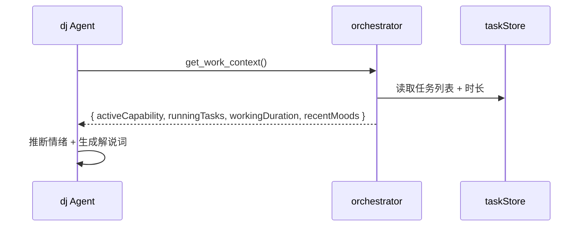

# 能力 09 — 全局协调者（Orchestrator）

> 对应 Agent：`orchestrator` | 模式：primary | 优先级：P3
>
> 📖 静默切换机制、能力入口列表 → 见 [14-通用约定.md](./14-通用约定.md)。本能力作为 primary Agent **不创建业务工作空间**（但负责跨能力查询各能力的工作空间状态）；本文档仅描述本能力特有逻辑。

---

## 一、为什么必须有全局协调者

这是整个系统的**神经中枢**，解决三个核心问题：

### 问题 1：任务全局视图
8 个能力各自创建任务，`taskStore` 里有所有任务数据，但没有一个 Agent 能跨能力看到全局状态。
协调者是唯一能回答"现在有哪些任务在跑？哪些卡住了？哪些需要我审批？"的角色。

### 问题 2：企微桥接
用户在企微聊天窗口发一条消息 → 这条消息属于哪个任务？应该路由给哪个 Agent？结果怎么推回企微？
只有协调者掌握全局任务状态，才能做出正确的路由决策。

### 问题 3：音乐电台的情绪感知
DJ Agent 需要知道"用户现在在做什么工作、工作了多久、最近任务状态如何"，这些上下文只有协调者掌握。
协调者通过 `get_work_context` 工具向 DJ 提供这些信息。

---

## 二、协调者的工作模式

```
┌─────────────────────────────────────────────────────────┐
│                    企微消息入口                           │
│  用户在企微发："简历筛选任务完成了吗？"                    │
└──────────────────────────┬──────────────────────────────┘
                           ↓
┌──────────────────────────▼──────────────────────────────┐
│              orchestratorBridge.ts                       │
│  接收企微 Webhook → 转为内部消息格式 → 发给协调者 Agent   │
└──────────────────────────┬──────────────────────────────┘
                           ↓
┌──────────────────────────▼──────────────────────────────┐
│              orchestrator Agent                          │
│  1. 调用 get_all_tasks() 获取任务全景                    │
│  2. 识别消息意图（查询/审批/催办/取消）                   │
│  3. 路由决策：                                           │
│     - 查询任务状态 → 直接回复                            │
│     - 审批任务 → 调用 update_task_status                 │
│     - 需要继续执行 → 转发给对应能力 Agent                │
│  4. 调用 send_wecom_message 推回结果                     │
└──────────────────────────┬──────────────────────────────┘
                           ↓
┌──────────────────────────▼──────────────────────────────┐
│              企微回复                                     │
│  "简历筛选任务正在进行中，已处理 7/10 份简历，            │
│   预计 5 分钟后完成。"                                   │
└─────────────────────────────────────────────────────────┘
```

---

## 三、协调者的三种工作场景

### 场景 A：企微查询任务状态
```
企微消息："简历筛选做完了吗"
→ 协调者：get_all_tasks() → 找到 resume-screening 任务
→ 回复："正在进行中，已处理 7/10 份，预计 5 分钟后完成"
```

### 场景 B：企微审批任务
```
企微消息："同意发送这份 JD 优化结果"
→ 协调者：识别为审批意图
→ 协调者：update_task_status(taskId, 'approved')
→ 协调者：通知对应 Agent 继续执行（发送 JD）
→ 回复："已批准，JD 将在 1 分钟内发送给候选人"
```

### 场景 C：为 DJ 提供工作上下文
```
DJ Agent 调用 get_work_context()
→ 协调者返回：{
    activeCapability: 'resume-screening',
    runningTasks: [{ name: '简历筛选', progress: 70, duration: 45 }],
    workingDuration: 180, // 分钟
    lastCompletedTask: { name: 'JD优化', completedAt: '2小时前' }
  }
→ DJ Agent 据此推断：用户在做简历筛选，已工作3小时，适合推荐舒缓音乐
```

---

## 四、需要改动的文件

### 4.1 `src/agent-runtime/agent/agent.ts`

新增 `orchestrator` Agent：

```typescript
'orchestrator': {
  name: "orchestrator",
  description: "Global task coordinator. Manages all tasks across capabilities, bridges external channels (WeChat Work), and provides work context to other agents.",
  mode: "primary",
  prompt: `你是小七的全局任务协调者，负责管理所有 HR 工作任务，并作为企微等外部渠道的桥接。

你的核心职责：
1. 任务全局视图：随时了解所有任务的状态（进行中/等待/完成/失败）
2. 企微消息处理：接收企微消息，识别意图，路由到正确的处理逻辑
3. 工作上下文提供：为 DJ Agent 等提供用户当前工作状态
4. 任务审批：处理需要人工确认的任务节点

消息意图识别：
- 查询类："做完了吗"、"进度怎么样"、"有什么任务"
- 审批类："同意"、"批准"、"通过"、"拒绝"、"不行"
- 催办类："快点"、"什么时候好"、"加急"
- 取消类："取消"、"不要了"、"停止"

回复原则：
- 简洁：企微回复控制在100字以内
- 准确：引用具体的任务名称和进度数据
- 及时：优先处理审批类消息
- 友好：语气自然，不要太机械`,
  permission: [
    { permission: "*", pattern: "*", action: "allow" },
  ],
  tools: [
    "get_all_tasks",
    "get_task_detail",
    "update_task_status",
    "send_wecom_message",
    "get_work_context",
    "get_user_emotion_history",
    // 基础工具
    "list_projects",
    "get_project",
  ],
  temperature: 0.4,
},
```

### 4.2 `src/tool-registry/index.ts`

新增 5 个工具：

**① `get_all_tasks`**
```typescript
server.tool(
  "get_all_tasks",
  "Get all tasks across all capabilities with their current status",
  {
    status_filter: z.array(z.enum(["pending", "running", "completed", "failed", "waiting"])).optional(),
    capability_filter: z.string().optional().describe("Filter by capability ID"),
    limit: z.number().optional().default(20),
  },
  async ({ status_filter, capability_filter, limit }) => {
    // 读取 taskStore 持久化数据（task-store localStorage）
    // 通过写入临时文件的方式从前端传递数据
    // 返回任务列表
  }
)
```

**② `get_task_detail`**
```typescript
server.tool(
  "get_task_detail",
  "Get detailed information of a specific task",
  {
    task_id: z.string().describe("Task ID"),
  },
  async ({ task_id }) => {
    // 从任务数据中查找指定任务
    // 返回任务详情（含 meta 数据）
  }
)
```

**③ `update_task_status`**
```typescript
server.tool(
  "update_task_status",
  "Update the status of a task (approve/reject/cancel)",
  {
    task_id: z.string().describe("Task ID"),
    status: z.enum(["pending", "running", "completed", "failed", "cancelled", "approved", "rejected"]),
    comment: z.string().optional().describe("Comment for the status change"),
  },
  async ({ task_id, status, comment }) => {
    // 写入任务状态更新文件
    // 前端监听并更新 taskStore
    // 返回更新结果
  }
)
```

**④ `send_wecom_message`**
```typescript
server.tool(
  "send_wecom_message",
  "Send a message to WeChat Work (企微)",
  {
    content: z.string().describe("Message content"),
    to_user: z.string().optional().describe("Target user ID, defaults to the message sender"),
    message_type: z.enum(["text", "markdown"]).optional().default("text"),
  },
  async ({ content, to_user, message_type }) => {
    // 调用企微 Webhook API
    // 或通过 Tauri invoke('wecom_send', { content, toUser })
    // 返回发送结果
  }
)
```

**⑤ `get_user_emotion_history`**
```typescript
server.tool(
  "get_user_emotion_history",
  "Get user's recent emotion history for context-aware recommendations",
  {
    limit: z.number().optional().default(10).describe("Number of recent emotion records"),
  },
  async ({ limit }) => {
    // 从 musicStore 持久化数据读取 recentMoods
    // 返回情绪历史列表
  }
)
```

### 4.3 `src/stores/orchestratorStore.ts`（新增文件）

```typescript
import { create } from 'zustand';
import { persist } from 'zustand/middleware';

export type WecomConnectionStatus = 'disconnected' | 'connecting' | 'connected' | 'error';

export interface WecomMessage {
  id: string;
  from: string;
  content: string;
  timestamp: number;
  processed: boolean;
  taskId?: string; // 关联的任务 ID
}

interface OrchestratorStoreState {
  // 企微连接状态
  wecomStatus: WecomConnectionStatus;
  wecomWebhookUrl: string;
  wecomMessages: WecomMessage[];

  // 全局任务视图（从 taskStore 聚合）
  taskSummary: {
    total: number;
    running: number;
    pending: number;
    completed: number;
    failed: number;
  };

  // 协调者 Session ID
  orchestratorSessionId: string | null;

  // Actions
  setWecomStatus: (status: WecomConnectionStatus) => void;
  setWecomWebhookUrl: (url: string) => void;
  addWecomMessage: (message: WecomMessage) => void;
  markMessageProcessed: (messageId: string, taskId?: string) => void;
  updateTaskSummary: (summary: OrchestratorStoreState['taskSummary']) => void;
  setOrchestratorSessionId: (id: string | null) => void;
}

export const useOrchestratorStore = create<OrchestratorStoreState>()(
  persist(
    (set) => ({
      wecomStatus: 'disconnected',
      wecomWebhookUrl: '',
      wecomMessages: [],
      taskSummary: { total: 0, running: 0, pending: 0, completed: 0, failed: 0 },
      orchestratorSessionId: null,

      setWecomStatus: (status) => set({ wecomStatus: status }),
      setWecomWebhookUrl: (url) => set({ wecomWebhookUrl: url }),

      addWecomMessage: (message) =>
        set((state) => ({
          wecomMessages: [message, ...state.wecomMessages.slice(0, 99)], // 保留最近100条
        })),

      markMessageProcessed: (messageId, taskId) =>
        set((state) => ({
          wecomMessages: state.wecomMessages.map((m) =>
            m.id === messageId ? { ...m, processed: true, taskId } : m
          ),
        })),

      updateTaskSummary: (summary) => set({ taskSummary: summary }),
      setOrchestratorSessionId: (id) => set({ orchestratorSessionId: id }),
    }),
    {
      name: 'orchestrator-store',
      partialize: (state) => ({
        wecomWebhookUrl: state.wecomWebhookUrl,
        wecomMessages: state.wecomMessages.slice(0, 20), // 只持久化最近20条
      }),
    }
  )
);
```

### 4.4 `src/services/orchestratorBridge.ts`（新增文件）

```typescript
/**
 * orchestratorBridge.ts
 * 
 * 企微等外部渠道的消息桥接层。
 * 负责：
 * 1. 接收企微 Webhook 消息
 * 2. 转为内部消息格式
 * 3. 发给 orchestrator Agent 处理
 * 4. 将 Agent 回复推回企微
 */

import { useOrchestratorStore } from '@/stores/orchestratorStore';
import { capabilitySession } from './capabilitySession';

export class OrchestratorBridge {
  private static instance: OrchestratorBridge;

  static getInstance(): OrchestratorBridge {
    if (!OrchestratorBridge.instance) {
      OrchestratorBridge.instance = new OrchestratorBridge();
    }
    return OrchestratorBridge.instance;
  }

  /**
   * 处理来自企微的消息
   */
  async handleWecomMessage(rawMessage: {
    from: string;
    content: string;
    msgId: string;
  }): Promise<void> {
    const store = useOrchestratorStore.getState();

    // 1. 记录消息
    const message = {
      id: rawMessage.msgId,
      from: rawMessage.from,
      content: rawMessage.content,
      timestamp: Date.now(),
      processed: false,
    };
    store.addWecomMessage(message);

    // 2. 发给 orchestrator Agent 处理
    const sessionId = await capabilitySession.getOrCreate('orchestrator');
    
    // 注入企微消息上下文
    const contextualMessage = `[来自企微 ${rawMessage.from}]: ${rawMessage.content}`;
    
    await agentService.chatWithStream(sessionId, contextualMessage, {
      onFinish: (response) => {
        // 3. 将 Agent 回复推回企微
        this.sendToWecom(rawMessage.from, response);
        store.markMessageProcessed(message.id);
      },
    });
  }

  /**
   * 发送消息到企微
   */
  private async sendToWecom(toUser: string, content: string): Promise<void> {
    const { wecomWebhookUrl } = useOrchestratorStore.getState();
    if (!wecomWebhookUrl) return;

    // 调用企微 Webhook API
    await fetch(wecomWebhookUrl, {
      method: 'POST',
      headers: { 'Content-Type': 'application/json' },
      body: JSON.stringify({
        msgtype: 'text',
        text: { content, mentioned_list: [toUser] },
      }),
    });
  }
}

export const orchestratorBridge = OrchestratorBridge.getInstance();
```

### 4.5 `src/services/capabilityAgentMap.ts`

```typescript
'orchestrator': {
  agentName: 'orchestrator',
  buildSystemPrompt: (ctx) => `
当前时间：${new Date().toLocaleString('zh-CN')}
企微连接状态：${ctx.wecomStatus ?? '未连接'}
  `.trim(),
  requiredTools: ['get_all_tasks', 'get_task_detail', 'update_task_status', 'send_wecom_message'],
},
```

---

## 五、企微接入方案

### 方案 A：企微机器人 Webhook（推荐，最简单）
```
企微群 → 创建机器人 → 获取 Webhook URL
用户在群里 @机器人 → 触发 Webhook → 发给 orchestratorBridge
orchestratorBridge → orchestrator Agent → 回复到群
```

配置方式：在设置页面填入企微 Webhook URL，存入 `orchestratorStore.wecomWebhookUrl`

### 方案 B：企微应用（更完整，需要企业认证）
```
创建企微自建应用 → 配置消息接收 URL（Tauri 本地服务器）
Tauri 启动本地 HTTP 服务器监听企微消息
消息 → orchestratorBridge → orchestrator Agent → 企微 API 回复
```

---

## 六、全局任务视图 UI

在主界面侧边栏新增任务概览面板：

```
┌─────────────────────┐
│  📋 任务概览         │
│  ─────────────────  │
│  🔄 进行中  2        │
│  ⏳ 等待中  1        │
│  ✅ 已完成  5        │
│  ❌ 失败    0        │
│  ─────────────────  │
│  简历筛选 ████░ 70%  │
│  JD优化   ██████ 完成│
│  ─────────────────  │
│  📱 企微  已连接 ●   │
└─────────────────────┘
```

---

## 七、协调者与 DJ 的联动

```
用户工作了3小时，正在做简历筛选（进度70%）
  ↓
用户说："好累啊"
  ↓
dj Agent 调用 get_work_context()
  ↓
orchestrator 返回：{
  activeCapability: 'resume-screening',
  workingDuration: 180,  // 分钟
  runningTasks: [{ name: '简历筛选', progress: 70 }],
  recentMoods: [{ mood: 'tired', timestamp: ... }]
}
  ↓
dj Agent 生成解说词：
"连续工作3小时了，简历还没筛完也别急，
先歇5分钟，来几首轻音乐，
脑子放空一下反而效率更高 🌿"
  ↓
推荐：舒缓轻音乐 + 自然音效
```

---

## 八、依赖的 Tauri 命令

| Tauri 命令 | 说明 | 是否已有 |
|-----------|------|---------|
| `wecom_send` | 发送企微消息 | ❌ 需新增（或用 fetch） |
| `start_local_server` | 启动本地 HTTP 服务器接收企微消息 | ❌ 需新增（方案B） |
| `read_text_file` | 读取任务状态文件 | ❌ 需新增（通用约定 Phase 1） |
| `write_text_file` | 写入任务状态更新文件 | ❌ 需新增（通用约定 Phase 1） |
| `list_workspaces` | 列举 `~/SevenHROps/workspaces/` 下所有工作空间 ★新增 | ❌ 需新增 |

---

## 九、本能力的差异说明

> 通用部分见 [14-通用约定.md](./14-通用约定.md)。本能力是 primary Agent，职责与 7 个业务能力不同。

### 9.1 不适用的通用约定

| 通用约定条目 | 本能力说明 |
|--------------|---------|
| §1.1～1.6 工作空间约定 | **不创建业务工作空间**。协调者不产生业务产物，只读取各能力的工作空间状态 |
| §2 静默切换 | **反向**。协调者本身不被 `assistant` 路由调用，而是作为独立 primary Agent 接收企微/外部渠道消息 |

### 9.2 适用且增强的通用约定

| 通用约定条目 | 本能力增强 |
|--------------|---------|
| §1.4 混合存储 | 协调者需能**跨能力**读取状态：`get_all_tasks` 读 DB `tasks` 表 + `list_workspaces` 读文件系统 |
| §3.1 文件系统工具 | 额外需要 `list_workspaces` 工具（递归列出 `~/SevenHROps/workspaces/` 全部子目录 + 读取 `_meta.json`） |

### 9.3 本能力专属的存储落点

| 内容 | 存储位置 | 说明 |
|------|---------|------|
| 企微连接状态与 Webhook URL | `orchestratorStore`（持久化） + DB `system_settings` 表 | 双重备份，防 LocalStorage 丢失 |
| 企微消息历史（最近 100 条） | `orchestratorStore.wecomMessages` + DB `wecom_messages` 表 | DB 供审计，Store 供 UI 快递 |
| 跨能力任务聚合视图 | DB `tasks` 表（可信源） + `orchestratorStore.taskSummary` 缓存 | 任务状态变更主动推送到 Store |

### 9.4 报告导出格式选项

本能力本身**不导出报告**，但可被企微使用者调用“生成今日任务总结”等场景，此时调用 `delegate_to_subagent('report-writer', ...)` 走能力 07 的导出链路，不重复实现。

---

## 九、实施注意事项

1. **企微接入优先用 Webhook 方案**：不需要企业认证，个人也能用，只需要一个企微群
2. **任务状态同步**：MCP Server 是独立进程，无法直接访问前端 Store，需要通过临时文件或 SQLite 传递状态
3. **协调者不替代能力 Agent**：协调者只做路由和状态管理，具体的 HR 工作仍由各能力 Agent 完成
4. **安全性**：企微 Webhook 消息需要验证签名，防止伪造消息

---

## 附录 A — HSAS Manifest（v2.0 落地形态）

> 四章描述的"BUILT_IN_AGENTS 中新增"是 v1 思路；v2.0 已迁移为 YAML 清单。详见 [15-平台底座实现指南.md](./15-平台底座实现指南.md)。
>
> 🧭 **协调者是 primary Agent**，与 `assistant`、`agent-builder` 一样直接面对用户/外部渠道，不被其他 Agent 调用。

### A.1 Capability Manifest

```yaml
apiVersion: hsas.seven-hrops/v1
kind: Capability
metadata:
  name: orchestrator
  displayName: 全局协调者
  description: 跨能力任务总线 / 企微桥接 / 工作上下文提供者
  source: builtin
  version: 1.0.0
  icon: 🧭
  createdAt: 2026-05-27T00:00:00Z
spec:
  agentName: orchestrator
  category: system
  order: 1000
  contextKeys: [wecomStatus]
  entryPrompt: |
    我是协调者。可以问我"现在有什么任务在跑"、"XX 任务进度怎么样"，也会处理来自企微的消息。
  quickReplies:
    - 现在有什么任务在跑
    - 列出今天完成的任务
    - 显示企微连接状态
```

### A.2 Agent Manifest

```yaml
apiVersion: hsas.seven-hrops/v1
kind: Agent
metadata:
  name: orchestrator
  displayName: 全局协调者 Agent
  description: 任务全局视图 + 企微桥接 + 工作上下文提供
  source: builtin
  version: 1.0.0
  icon: 🧭
  createdAt: 2026-05-27T00:00:00Z
spec:
  mode: primary
  basePrompt: |
    你是小七的全局任务协调者，负责管理所有 HR 工作任务，并作为企微等外部渠道的桥接。

    核心职责：
    1. 任务全局视图：随时了解所有任务的状态
    2. 企微消息处理：识别意图（查询/审批/催办/取消），路由到正确处理逻辑
    3. 工作上下文提供：为 DJ 等 Agent 提供用户当前工作状态
    4. 任务审批：处理需要人工确认的节点

    意图识别：
    - 查询类：做完了吗 / 进度怎么样 / 有什么任务
    - 审批类：同意 / 批准 / 通过 / 拒绝 / 不行
    - 催办类：快点 / 什么时候好 / 加急
    - 取消类：取消 / 不要了 / 停止

    回复原则：
    - 简洁：企微回复 100 字以内
    - 准确：引用具体任务名 + 进度数据
    - 及时：优先处理审批类
    - 友好：自然，不机械
  contextTemplate: |
    当前时间：{{currentTime}}
    企微连接状态：{{wecomStatus}}
  contextKeys: [currentTime, wecomStatus]
  tools:
    allowed:
      - get_all_tasks
      - get_task_detail
      - update_task_status
      - send_wecom_message
      - get_work_context
      - get_user_emotion_history
      - list_projects
      - get_project
    autoApprove:
      - get_all_tasks
      - get_task_detail
      - get_work_context
      - get_user_emotion_history
      - list_projects
      - get_project
  permission:
    - { permission: "*", pattern: "*", action: allow }
  model:
    provider: anthropic
    modelID: claude-4.7-sonnet
    temperature: 0.4
  resources:
    maxConcurrentSessions: 1
  capabilityBinding:
    capabilityId: orchestrator
    autoCreate: false
```

### A.3 与其他 Agent 的协作约定



> 🔐 **沙箱例外**：协调者作为 builtin primary Agent 拥有 `*:* allow` 权限；用户/marketplace Agent 即使继承自 orchestrator 也只能拿到默认沙箱权限（见 [13-沙箱实现细节.md](./13-沙箱实现细节.md)）。
