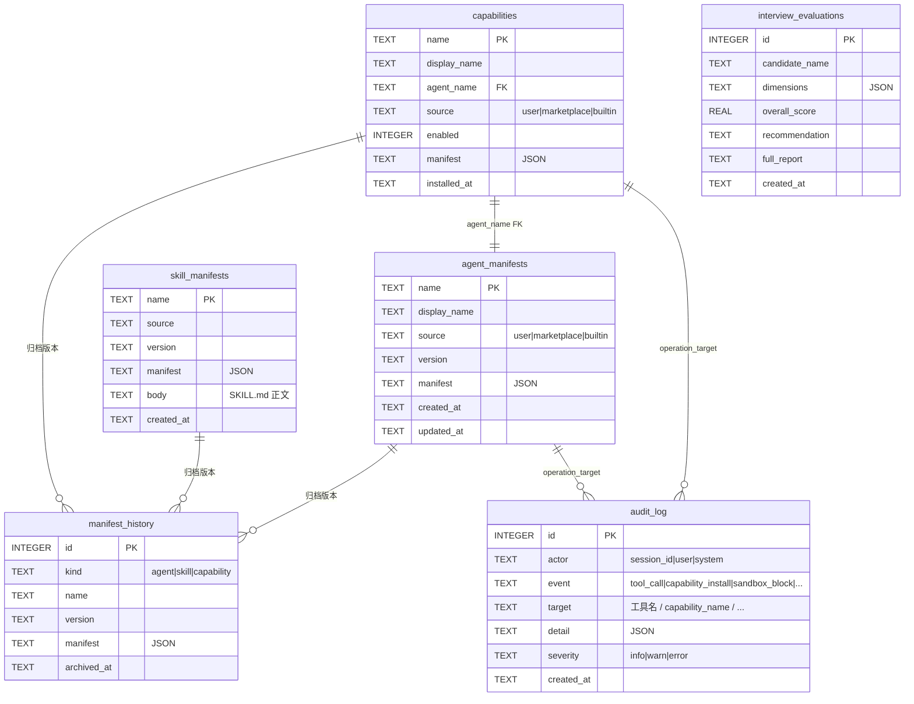

# DB Schema — SQLite 数据模型权威定义

> **本文档目标**：作为**唯一可信源**整合分散在 [00] / [10] / [11] / [15] / [05] / [12] 中的 SQLite 表设计，给出完整 DDL、ER 图、Phase 划分、迁移规则。
>
> **优先级**：当本文档与其他文档对表结构的描述冲突时，**以本文档为准**。其他文档应在下次更新时同步过来。

---

## 〇、一图概览



> 注：`builtin` source 的 Capability **不**写入 SQLite（[15] §八 通过 `builtinSeed.ts` 内存注入），但 `audit_log` 中可以引用其名字。

---

## 一、版本与迁移规则

### 1.1 版本号

| 版本 | 文件 | 引入内容 |
|---|---|---|
| `v1` | `src-tauri/migrations/v1_baseline.sql` | 项目原有的业务表（`interview_evaluations` 等） |
| `v2` | `src-tauri/migrations/v2_capabilities.sql` ★ | **本次 Phase 0 新增**：`agent_manifests` / `skill_manifests` / `capabilities` / `manifest_history` |
| `v3` | `src-tauri/migrations/v3_audit_log.sql` | **Phase 0.5 沙箱**：`audit_log` |
| `v4` | `src-tauri/migrations/004_sessions_and_messages.sql` | **会话持久化**：`sessions` / `messages` |
| `v5+` | 视后续业务追加 | — |

### 1.2 迁移工具

- 推荐使用 [`tauri-plugin-sql`](https://github.com/tauri-apps/plugins-workspace) 的 builtin migration runner
- 启动时自动检测 `__migrations__` 表，按版本顺序执行未跑过的 `.sql`
- **每个 `.sql` 文件必须是幂等的**（用 `CREATE TABLE IF NOT EXISTS`）

### 1.3 命名规则（与 [14] §0.4 一致）

- 表名 / 列名：`snake_case`
- JSON 字段（`manifest` / `dimensions`）：内部 key 跟随 HSAS Spec 的字段命名（即 `camelCase`，因为存的是 TS 对象序列化）
- 时间戳：统一用 ISO 8601 字符串（`TEXT`，例 `2026-05-27T20:00:00+08:00`），**不**用 `INTEGER` Unix timestamp，便于 SQL 查询时人类可读

---

## 二、Phase 0 必须的 4 张表（v2 迁移）

> 完整 DDL，可直接 `cat > src-tauri/migrations/v2_capabilities.sql`

```sql
-- ============================================================
-- v2_capabilities.sql — Phase 0 平台底座所需的核心表
-- 来源：00 §七 / 11 §十三 / 15 §10.2 整合
-- ============================================================

-- ---------- 1. agent_manifests ----------
CREATE TABLE IF NOT EXISTS agent_manifests (
  name         TEXT PRIMARY KEY,
  display_name TEXT NOT NULL,
  source       TEXT NOT NULL CHECK(source IN ('user','marketplace')),
  version      TEXT NOT NULL,
  manifest     TEXT NOT NULL,           -- JSON 序列化的完整 Manifest（含 spec 全部字段）
  created_at   TEXT NOT NULL,
  updated_at   TEXT
);
CREATE INDEX IF NOT EXISTS idx_agent_source ON agent_manifests(source);

-- ---------- 2. skill_manifests ----------
CREATE TABLE IF NOT EXISTS skill_manifests (
  name       TEXT PRIMARY KEY,
  source     TEXT NOT NULL CHECK(source IN ('user','marketplace')),
  version    TEXT NOT NULL,
  manifest   TEXT NOT NULL,
  body       TEXT,                      -- SKILL.md 正文（Markdown）
  created_at TEXT NOT NULL
);
CREATE INDEX IF NOT EXISTS idx_skill_source ON skill_manifests(source);

-- ---------- 3. capabilities ----------
CREATE TABLE IF NOT EXISTS capabilities (
  name          TEXT PRIMARY KEY,
  display_name  TEXT NOT NULL,
  agent_name    TEXT NOT NULL,
  source        TEXT NOT NULL CHECK(source IN ('user','marketplace')),
  enabled       INTEGER NOT NULL DEFAULT 1 CHECK(enabled IN (0,1)),
  manifest      TEXT NOT NULL,
  installed_at  TEXT NOT NULL,
  FOREIGN KEY (agent_name) REFERENCES agent_manifests(name) ON DELETE RESTRICT
);
CREATE INDEX IF NOT EXISTS idx_capability_enabled ON capabilities(enabled);
CREATE INDEX IF NOT EXISTS idx_capability_source  ON capabilities(source);

-- ---------- 4. manifest_history ----------
CREATE TABLE IF NOT EXISTS manifest_history (
  id          INTEGER PRIMARY KEY AUTOINCREMENT,
  kind        TEXT NOT NULL CHECK(kind IN ('Agent','Skill','Capability')),
  name        TEXT NOT NULL,
  version     TEXT NOT NULL,
  manifest    TEXT NOT NULL,
  archived_at TEXT NOT NULL
);
CREATE INDEX IF NOT EXISTS idx_history_lookup ON manifest_history(kind, name);
```

### 2.1 字段语义详解

#### `agent_manifests.source`

- `user`：用户通过 AgentBuilder 创建的 Agent
- `marketplace`：从市场安装的 Agent
- ❌ **不存** `builtin`：内置 Agent 通过 `builtinSeed.ts` 内存注入，不入库（避免重复源）

#### `capabilities.agent_name` 外键约束

- 删除策略 `ON DELETE RESTRICT`：不允许在 Agent 还被引用时删除 Agent，必须先 uninstall 引用它的 Capability
- ✅ 这能避免"能力卡片存在但点进去没 Agent"的脏状态

#### `capabilities.enabled`

- `1`：能力可见、可调用
- `0`：能力被用户软关闭，仍存在 SQLite 但 `bootstrap()` 加载时会跳过注册到 `Agent.Service`
- 用途：用户临时停用某个 Capability 而不丢配置

#### `manifest_history`

- 用途：保留每次 Manifest 变更的历史版本（用户编辑、AgentBuilder 修改）
- 触发时机：在 `capabilityRegistry.update()` 调用时**先**写历史，**后**更新主表
- 不做自动清理（数据量小，10000 条以内可接受）

---

## 四、Phase 0.5 新增表（v3 迁移）

```sql
-- ============================================================
-- v3_audit_log.sql — 沙箱与审计日志
-- 来源：10 §五 / 12 §三 / 13 §七 整合
-- ============================================================

CREATE TABLE IF NOT EXISTS audit_log (
  id          INTEGER PRIMARY KEY AUTOINCREMENT,
  actor       TEXT NOT NULL,                      -- session_id / user / system
  event       TEXT NOT NULL,                      -- tool_call|capability_install|sandbox_block|fs_write|...
  target      TEXT,                               -- 受影响的对象名
  detail      TEXT,                               -- JSON：完整上下文
  severity    TEXT NOT NULL DEFAULT 'info'
              CHECK(severity IN ('info','warn','error')),
  created_at  TEXT NOT NULL
);
CREATE INDEX IF NOT EXISTS idx_audit_event   ON audit_log(event);
CREATE INDEX IF NOT EXISTS idx_audit_actor   ON audit_log(actor);
CREATE INDEX IF NOT EXISTS idx_audit_created ON audit_log(created_at);
```

### 3.1 `event` 取值规范

| 类别 | event 值 | 触发点 |
|---|---|---|
| 工具调用 | `tool_call` | 每次成功的 `Tool.Service.execute()` |
| 工具拒绝 | `tool_denied` | 沙箱白名单不通过 |
| 文件读写 | `fs_read` / `fs_write` | Rust `fs_guard` |
| 网络 | `network_call` / `network_denied` | network_guard |
| 能力管理 | `capability_install` / `capability_uninstall` / `capability_disable` | capabilityRegistry |
| AgentBuilder | `agent_builder_install` / `agent_builder_dryrun_failed` | 10-AgentBuilder |
| 配额 | `quota_exceeded` | RateLimiter / TokenQuota |
| 沙箱拦截 | `sandbox_block` | 兜底（Rust 端拦截） |

> 新增 event 值时，**必须**先在本文 §4.1 表中登记。

---

## 五、会话与消息表（v4 迁移）★ 新增

> 完整 DDL，可直接 `cat > src-tauri/src/db/migrations/004_sessions_and_messages.sql`
>
> 来源：arch-session-db-persistence Task 1.1

### 5.1 设计背景

将会话（Session）和消息（Message）从前端 localStorage 迁移到 SQLite 数据库，实现：
- 数据持久化，跨会话不丢失
- 支持分页查询，性能更优
- 支持软删除（`status = 'deleted'`）
- 为企微集成打基础（会话事件日志）

**核心设计决策**：会话即任务（Session = Task）

### 5.2 DDL

```sql
-- ============================================================
-- 004_sessions_and_messages.sql — 会话与消息持久化
-- 来源：arch-session-db-persistence Task 1.1
-- ============================================================

-- ---------- 1. sessions（会话即任务） ----------
CREATE TABLE IF NOT EXISTS `sessions` (
    `id` text PRIMARY KEY NOT NULL,
    `title` text NOT NULL DEFAULT '新会话',
    `session_type` text NOT NULL DEFAULT 'normal',
    `capability_id` text,
    `capability_name` text,
    `status` text NOT NULL DEFAULT 'active',
    `schedule_config` text,  -- JSON，定时任务配置（未来使用）
    `last_message_at` text,
    `message_count` integer NOT NULL DEFAULT 0,
    `model_config` text,  -- JSON: {providerID, modelID, baseURL}
    `created_at` text DEFAULT (datetime('now')) NOT NULL,
    `updated_at` text DEFAULT (datetime('now')) NOT NULL,
    FOREIGN KEY (`capability_id`) REFERENCES `capabilities`(`name`) ON UPDATE no action ON DELETE set null
);

CREATE INDEX IF NOT EXISTS `idx_sessions_status` ON `sessions`(`status`);
CREATE INDEX IF NOT EXISTS `idx_sessions_created_at` ON `sessions`(`created_at` DESC);
CREATE INDEX IF NOT EXISTS `idx_sessions_last_message` ON `sessions`(`last_message_at` DESC);

-- ---------- 2. messages ----------
CREATE TABLE IF NOT EXISTS `messages` (
    `id` text PRIMARY KEY NOT NULL,
    `session_id` text NOT NULL,
    `role` text NOT NULL,
    `content` text NOT NULL,
    `content_parts` text,
    `tool_calls` text,
    `tokens_used` integer,
    `latency_ms` integer,
    `created_at` text DEFAULT (datetime('now')) NOT NULL,
    FOREIGN KEY (`session_id`) REFERENCES `sessions`(`id`) ON UPDATE no action ON DELETE cascade
);

CREATE INDEX IF NOT EXISTS `idx_messages_session_id` ON `messages`(`session_id`);
CREATE INDEX IF NOT EXISTS `idx_messages_created_at` ON `messages`(`created_at`);
```

### 5.3 字段语义详解

#### `sessions.session_type`

- `normal`：普通会话
- `scheduled`：定时任务（未来实现）

#### `sessions.status`

- `active`：活跃，在会话列表中显示
- `archived`：已归档（未来实现）
- `deleted`：软删除，列表中不显示，但数据保留

#### `sessions.capability_id`

- 关联的能力 ID，NULL 表示闲聊会话
- 外键指向 `capabilities(name)`，删除能力时设为 NULL（`ON DELETE set null`）

#### `sessions.message_count`

- 冗余字段，避免每次加载会话列表都执行 `COUNT(*)` 查询
- 在 `message_repo::create()` 中自动 +1

#### `sessions.model_config`

- JSON 格式：`{ "providerID": "...", "modelID": "...", "baseURL": "..." }`
- 每个会话可以独立配置使用的模型

#### `messages.role`

- `user`：用户消息
- `assistant`：AI 回复
- `system`：系统消息（未来实现）

#### `messages.content_parts`

- JSON 格式，用于多模态内容（图片、文件等）
- 未来扩展使用

#### `messages.tool_calls`

- JSON 格式，记录工具调用记录
- 格式：`[{ "tool": "...", "args": {...}, "result": {...} }]`

### 5.4 典型查询样板

#### 分页加载会话列表（按最后消息时间倒序）

```sql
SELECT id, title, capability_name, status, last_message_at, message_count
FROM sessions
WHERE status = 'active'
ORDER BY last_message_at DESC
LIMIT ? OFFSET ?;
```

#### 获取会话的消息列表（按时间正序）

```sql
SELECT id, role, content, tool_calls, tokens_used, created_at
FROM messages
WHERE session_id = ?
ORDER BY created_at ASC;
```

#### 软删除会话

```sql
UPDATE sessions
SET status = 'deleted', updated_at = datetime('now')
WHERE id = ?;
```

#### 更新会话最后消息时间（事务）

```sql
BEGIN;
  INSERT INTO messages (...) VALUES (...);
  UPDATE sessions
  SET last_message_at = datetime('now'),
      message_count = message_count + 1,
      updated_at = datetime('now')
  WHERE id = ?;
COMMIT;
```

---

## 六、业务表（v1 baseline，已存在）

> 这部分是项目原有表，本次 Phase 0 **不改**。仅在此登记，保证全局只有一份 schema 文档。

### 6.1 `interview_evaluations`（来自 [05-面试评价.md](./05-面试评价.md) §3.3）

```sql
CREATE TABLE IF NOT EXISTS interview_evaluations (
  id              INTEGER PRIMARY KEY AUTOINCREMENT,
  candidate_name  TEXT NOT NULL,
  jd_id           TEXT,
  audio_path      TEXT,
  transcript      TEXT,
  dimensions      TEXT NOT NULL,    -- JSON：5 维度评分 + 句子级证据
  overall_score   REAL,
  recommendation  TEXT,             -- strong-hire | hire | no-hire | strong-no-hire
  full_report     TEXT,             -- Markdown 主体
  created_at      TEXT NOT NULL,
  updated_at      TEXT
);
CREATE INDEX IF NOT EXISTS idx_eval_candidate ON interview_evaluations(candidate_name);
CREATE INDEX IF NOT EXISTS idx_eval_jd        ON interview_evaluations(jd_id);
```

### 6.2 其他业务表

| 表名 | 来源能力 | 状态 |
|---|---|---|
| `resume_screenings` | [01-简历筛选.md](./01-简历筛选.md) | 已有，结构详见 01 文档 |
| `jd_versions` | [02-JD优化.md](./02-JD优化.md) | 已有 |
| `(其他)` | — | 各业务能力按需追加，但**必须**在本文 §四 登记 |

> ⚠️ **新增业务表的强制流程**：
> 1. 在对应业务能力文档（01~09）写完整 DDL
> 2. 在本文 §四 加一行登记
> 3. 创建 `vN_xxx.sql` 迁移文件

---

## 七、SQLite 文件位置

| 平台 | 路径 |
|---|---|
| macOS | `~/Library/Application Support/com.seven-hrops/seven-hrops.db` |
| Windows | `%APPDATA%\com.seven-hrops\seven-hrops.db` |
| Linux | `~/.local/share/com.seven-hrops/seven-hrops.db` |

代码中**必须**使用 Tauri API `app.path().app_data_dir()` 获取，**不要**硬编码。

---

## 八、典型查询样板

### 8.1 启动时加载所有用户 Capability

```sql
SELECT name, display_name, agent_name, manifest
FROM capabilities
WHERE source IN ('user','marketplace') AND enabled = 1;
```

### 8.2 查询某个 Capability 的所有历史版本

```sql
SELECT version, archived_at, manifest
FROM manifest_history
WHERE kind = 'Capability' AND name = ?
ORDER BY archived_at DESC;
```

### 8.3 最近 7 天的沙箱拦截记录

```sql
SELECT created_at, actor, target, detail
FROM audit_log
WHERE event IN ('sandbox_block','tool_denied','network_denied')
  AND created_at >= datetime('now','-7 days')
ORDER BY created_at DESC;
```

### 8.4 卸载 Capability 的事务

```sql
BEGIN;
  -- 1. 备份到 history
  INSERT INTO manifest_history (kind, name, version, manifest, archived_at)
  SELECT 'Capability', name, json_extract(manifest, '$.metadata.version'), manifest, datetime('now')
  FROM capabilities WHERE name = ?;

  -- 2. 删除 Capability
  DELETE FROM capabilities WHERE name = ?;

  -- 3. （可选）若 Agent 已无其他 Capability 引用，也删除 Agent
  DELETE FROM agent_manifests
  WHERE name = (SELECT agent_name FROM capabilities WHERE name = ?)
    AND NOT EXISTS (
      SELECT 1 FROM capabilities WHERE agent_name = agent_manifests.name AND name != ?
    );

  -- 4. 写审计
  INSERT INTO audit_log (actor, event, target, severity, created_at)
  VALUES (?, 'capability_uninstall', ?, 'info', datetime('now'));
COMMIT;
```

---

## 九、Phase 划分一览

| 阶段 | 迁移文件 | 表 | 状态 |
|---|---|---|---|
| **Phase 0** | `v2_capabilities.sql` | `agent_manifests` / `skill_manifests` / `capabilities` / `manifest_history` | ★ 必做 |
| **Phase 0.5** | `v3_audit_log.sql` | `audit_log` | ★ 沙箱启用前必做 |
| **Phase 1** | `v4_sessions_and_messages.sql` | `sessions` / `messages` | ★ 会话持久化 |
| **Phase 2~4** | 各业务能力按需 | `resume_screenings` / `jd_versions` / … | 跟随业务 |
| **Phase 5** | `v5_marketplace.sql`（暂定） | `marketplace_index` | AgentBuilder 上线时 |

---

## 十、相关文档

- [11-HSAS-Spec.md](./11-HSAS-Spec.md) — `manifest` JSON 字段的具体结构
- [15-平台底座实现指南.md](./15-平台底座实现指南.md) §10.2 — 本文表的 Rust 调用代码（`tauri::command`）
- [13-沙箱实现细节.md](./13-沙箱实现细节.md) §七 — `audit_log` 的写入封装
- [16-开发者快速上手.md](./16-开发者快速上手.md) §四 — 用本文 schema 验收 Phase 0
- [14-通用约定.md](./14-通用约定.md) §0.4 — 命名规则
